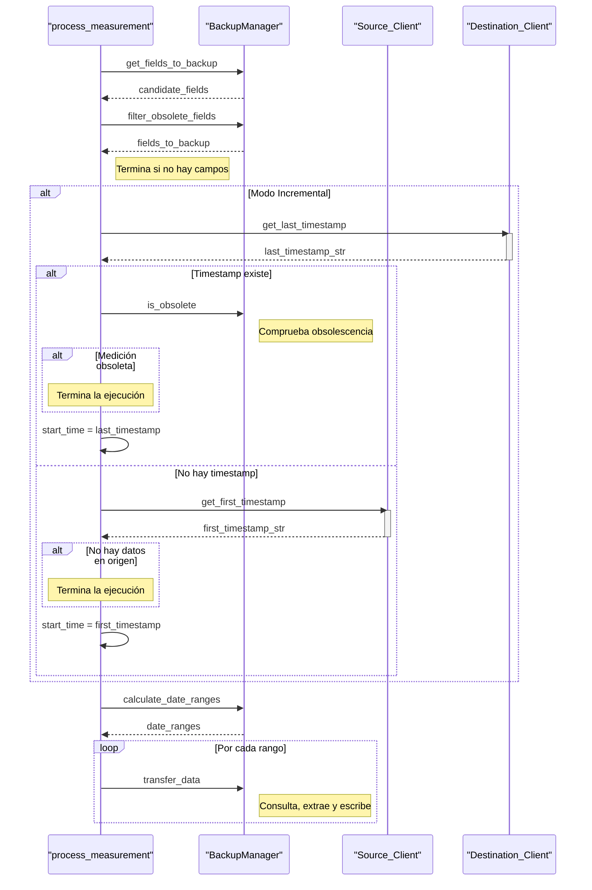
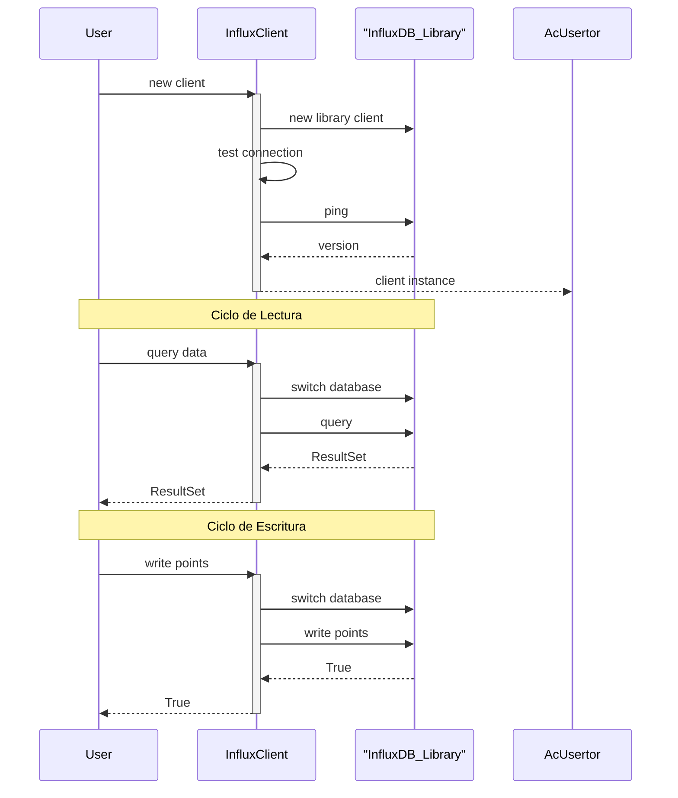
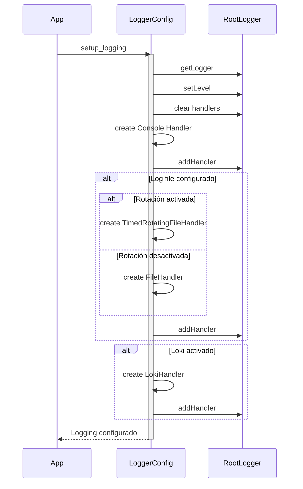

# Módulo: Orquestador de Backups para InfluxDB

## Descripción General

Este módulo constituye una solución robusta y configurable para realizar copias de seguridad de bases de datos InfluxDB. Su diseño permite orquestar múltiples procesos de backup en paralelo, cada uno gobernado por su propio archivo de configuración YAML.

El sistema es capaz de realizar dos tipos de backups:
1.  **Backups de Rango (`range`)**: Copias de seguridad de un intervalo de tiempo específico, definidas por una fecha de inicio y fin. Se ejecutan una sola vez.
2.  **Backups Incrementales (`incremental`)**: Copias de seguridad continuas que solo transfieren los datos nuevos desde la última ejecución. Pueden ejecutarse una vez o de forma recurrente según una programación CRON.

La arquitectura se basa en un script principal (`main.py`) que actúa como orquestador, lanzando un proceso independiente para cada configuración de backup encontrada. Cada proceso trabajador (`worker`) gestiona el ciclo de vida completo de su tarea de backup, desde la conexión a las bases de datos hasta la transferencia de datos, garantizando aislamiento y resiliencia.

---

## Desglose de Tareas y Flujos de Datos

A continuación se detallan las tareas principales orquestadas por el módulo.

### Tarea 1: Orquestación Principal (`main.py`)

- **Descripción**: El script `main.py` es el punto de entrada del sistema. Su función es escanear el directorio `/config` en busca de archivos de configuración (`*.yaml`), excluyendo plantillas. Por cada configuración válida, lanza un proceso "worker" (`run_worker`) en paralelo utilizando el módulo `multiprocessing` de Python, asignándole la responsabilidad de gestionar un único flujo de backup.
- **Flujo de Datos**:
  - **Origen**:
    - **Sistema**: Sistema de archivos local.
    - **Ruta**: Directorio `/config`.
    - **Recurso**: Ficheros de configuración `*.yaml`.
  - **Destino**: N/A (Lanza procesos del sistema operativo).
- **Diagrama de Secuencia**:
  ```mermaid
  sequenceDiagram
      participant Main as "main.py"
      participant FS as "Sistema de Archivos"
      participant Worker as "Proceso Worker (run_worker)"

      Main->>FS: Buscar ficheros *.yaml en /config
      FS-->>Main: Lista de ficheros de configuración
      Note right of Main: Excluye los ficheros .template.yaml

      loop Por cada fichero de configuración
          Main->>Main: Crear nuevo proceso para run_worker(config_file)
          Main->>Worker: Iniciar proceso (process.start())
          Note right of Worker: Cada worker se ejecuta en paralelo
      end

      Main->>Main: Esperar a que todos los workers finalicen (process.join())
  ```

  - **Explicación del Diagrama**:
    1.  El script `main.py` (representado como **Main**) inicia su ejecución.
    2.  Consulta al **Sistema de Archivos** (`FS`) para obtener una lista de todos los ficheros que terminan en `.yaml` dentro del directorio `/config`.
    3.  Una vez recibe la lista, la filtra para excluir cualquier fichero que sea una plantilla (que termine en `.template.yaml`).
    4.  Entra en un bucle: por cada fichero de configuración válido, crea un nuevo proceso **Worker** (`run_worker`) y lo inicia. Cada uno de estos workers se ejecuta de forma independiente y paralela.
    5.  Después de lanzar todos los procesos, el script principal se detiene y espera (`join`) a que cada uno de los workers haya completado su tarea antes de finalizar su propia ejecución.

### Tarea 2: Proceso de Backup (`BackupManager`)

- **Descripción**: Esta es la tarea central, ejecutada por cada `worker`. El `BackupManager` gestiona todo el ciclo de vida de una copia de seguridad. Primero, determina el modo (`range` o `incremental`). Luego, calcula el rango de tiempo a procesar; para el modo incremental, consulta el último timestamp en la base de datos de destino para sincronizar solo los datos nuevos. Para evitar consultas masivas, el rango de tiempo total se divide en fragmentos más pequeños (`chunks`). El proceso itera sobre estos fragmentos, consultando los datos del origen y escribiéndolos en el destino. Implementa una política de reintentos para manejar fallos transitorios en la red o en la base de datos.
- **Flujo de Datos**:
  - **Origen**:
    - **Sistema**: InfluxDB (Origen)
    - **Base de Datos**: Definida en `source.databases[].name` (config.yaml)
    - **Medida**: Todas las mediciones (o filtradas por `measurements.include`/`exclude` en config.yaml)
  - **Destino**:
    - **Sistema**: InfluxDB (Destino)
    - **Base de Datos**: Definida en `source.databases[].destination` (config.yaml)
    - **Medida**: Las mismas que en el origen.
- **Diagrama de Secuencia (Detallado)**:
  ```mermaid
    sequenceDiagram
        participant Worker as "Worker (run_worker)"
        participant BM as "BackupManager"
        participant InfluxClientSrc as "Cliente InfluxDB (Origen)"
        participant InfluxClientDst as "Cliente InfluxDB (Destino)"

        Worker->>BM: Iniciar Backup
        BM->>BM: Leer modo de backup (range/incremental)

        alt Modo Incremental
            BM->>InfluxClientDst: Obtener último timestamp de la medición en destino
            activate InfluxClientDst
            InfluxClientDst-->>BM: Timestamp o None
            deactivate InfluxClientDst
            alt Destino vacío o error
                 BM->>BM: Usar fallback ('options.incremental.fallback_days') para calcular fecha de inicio
            end
        else Modo Range
            BM->>BM: Usar 'start_date' y 'end_date' de la configuración
        end

        BM->>InfluxClientSrc: Obtener lista de mediciones a respaldar
        activate InfluxClientSrc
        InfluxClientSrc-->>BM: Lista de mediciones
        deactivate InfluxClientSrc
        BM->>BM: Filtrar mediciones (include/exclude)

        BM->>BM: Calcular fragmentos de tiempo (chunks) para el rango total

        loop Por cada fragmento de tiempo (chunk)
            BM->>InfluxClientSrc: Obtener campos y tipos para la medición
            activate InfluxClientSrc
            InfluxClientSrc-->>BM: Lista de campos (fields)
            deactivate InfluxClientSrc
            BM->>BM: Filtrar campos (include/exclude/types)

            Note over BM: Inicia bucle de reintentos
            loop reintentos
                BM->>InfluxClientSrc: Construir y ejecutar QUERY (SELECT ... WHERE time >= ... AND time < ...)
                activate InfluxClientSrc
                InfluxClientSrc-->>BM: Datos como DataFrame de Pandas
                deactivate InfluxClientSrc

                alt Consulta exitosa y datos recibidos
                    break Escritura y salida del bucle de reintentos
                        BM->>InfluxClientDst: Escribir DataFrame en la DB de destino
                        activate InfluxClientDst
                        InfluxClientDst-->>BM: Confirmación de escritura
                        deactivate InfluxClientDst
                    end
                else Consulta falla o no hay datos
                    BM->>BM: Esperar 'retry_delay' y continuar reintento
                end
            end
            alt Fallan todos los reintentos
                BM->>Worker: Lanzar Excepción. El error queda registrado.
            end
        end
        Worker->>Worker: Tarea de backup finalizada (o fallida)
  ```

  - **Explicación del Diagrama**:
    1.  El **Worker** da la orden de iniciar el backup al **BackupManager** (`BM`).
    2.  El `BM` primero lee su configuración para saber si el modo es `incremental` o `range`.
    3.  **Si es `incremental`**, consulta al **Cliente InfluxDB de Destino** para obtener el último timestamp registrado. Si no hay datos, utiliza una fecha de fallback para empezar.
    4.  A continuación, obtiene del **Cliente InfluxDB de Origen** la lista de mediciones y las filtra según la configuración.
    5.  Calcula los fragmentos de tiempo (`chunks`) en los que dividirá la consulta total para no sobrecargar las bases de datos.
    6.  Inicia un bucle por cada `chunk` y, dentro de él, un **bucle de reintentos** para dar robustez al proceso.
    7.  En cada reintento, consulta los datos del origen. Si la consulta tiene éxito y devuelve datos, los escribe en el destino y sale del bucle de reintentos usando `break`. Si falla o no devuelve datos, espera un tiempo (`retry_delay`) y vuelve a intentarlo.
    8.  Si todos los reintentos fallan para un `chunk`, se registra un error crítico y se lanza una excepción.
    9.  Una vez procesados todos los `chunks`, la tarea del worker finaliza.

---
## Componentes Auxiliares

Scripts que proporcionan funcionalidades clave al sistema.

- **`config.py`**:
  - **Descripción**: Una clase `Config` que carga un fichero de configuración YAML, valida que las claves esenciales (`source`, `destination`, `options`, etc.) estén presentes y proporciona un método `get()` para acceder a valores anidados usando notación de puntos (ej. `options.retries`).

- **`influx_client.py`**:
  - **Descripción**: Una clase `InfluxClient` que actúa como un cliente para InfluxDB 1.x. Envuelve la librería `influxdb-python`, proporcionando métodos para realizar consultas (`SHOW MEASUREMENTS`, `SHOW FIELD KEYS`, `get_last_timestamp`), crear bases de datos y gestionar la conexión.
  - **Nota Importante**: Se asume que esta clase ha sido extendida localmente para incluir los métodos `query_to_dataframe` y `write_dataframe`, que son llamados por el `BackupManager` para leer datos en un DataFrame de Pandas y escribirlo, respectivamente. Esta funcionalidad es crítica para la transferencia de datos.

- **`scheduler.py`**:
  - **Descripción**: Proporciona una clase `Scheduler` que envuelve la librería `APScheduler`. Permite programar la ejecución de una función (`backup_manager.run_backup`) según una expresión CRON definida en la configuración (`options.incremental.schedule`). Su inicio es bloqueante. También ofrece una función `run_job_once` para ejecuciones únicas.

- **`logger_config.py`**:
  - **Descripción**: Configura el sistema de logging. Permite inicializar loggers con diferentes niveles, rotación de archivos, envío de logs a Grafana Loki y formateo centralizado. Cada worker configura su propio logger para escribir en un archivo y directorio específicos, evitando así la mezcla de logs entre diferentes procesos de backup.

---

## Plan de Ejecución

El siguiente diagrama de Gantt visualiza cómo se planifican las tareas. La ejecución real depende de la configuración de cada fichero `.yaml`.

```mermaid
gantt
    title Plan de Ejecución de Tareas (Ejemplo)
    dateFormat HH:mm
    axisFormat %H:%M
    todayMarker stroke-width:0px

    section Tareas Únicas (Modo Range)
    "Backup datos históricos Q1" : 01:00, 30m
    "Backup específico Cliente A"      : 02:00, 5m

    section Tareas Recurrentes (Modo Incremental)
    "Sincronización BBDD_1 (cada 15 min)" : 00:00, 2m
    "Sincronización BBDD_1 (cada 15 min)" : 00:15, 2m
    "... resto de ejecuciones" : 00:30, 23h29m
```



---

## Diagramas de Secuencia por Componente

Esta sección ofrece una visión más granular de la interacción interna de los componentes clave.

### `backup.py` (Lógica interna de `_process_measurement`)

El siguiente diagrama detalla la lógica interna del método `_process_measurement`, que es el corazón del `BackupManager`. Muestra cómo se decide el rango de tiempo para los backups incrementales y cómo se gestiona la paginación de datos.



  - **Explicación del Diagrama**:
    1.  La secuencia se centra en un único `_process_measurement` (`PM`), que es llamado para cada medición a respaldar.
    2.  Primero, obtiene y filtra los campos (`fields`) a respaldar, primero según la configuración y luego descartando los que se consideran obsoletos (aquellos sin datos recientes en el destino).
    3.  **Si el modo es `incremental`**, necesita determinar desde qué punto empezar. Consulta el último timestamp en el destino (`DstClient`). Si lo encuentra, comprueba si la medición entera está obsoleta (ej. sin datos nuevos en más de 'X' días). Si está obsoleta, termina. Si no hay timestamp en el destino, consulta el *primer* timestamp en el origen (`SrcClient`) para iniciar el backup desde el principio de los tiempos.
    4.  Una vez tiene un `start_time`, lo utiliza para calcular los rangos de fechas de paginación (`date_ranges`).
    5.  Finalmente, itera sobre estos rangos y llama a la función `_transfer_data` para cada uno, que es la que efectivamente realiza la consulta y escritura de datos para ese pequeño intervalo de tiempo.

### `influx_client.py` (`InfluxClient`)

Este diagrama ilustra el rol de `InfluxClient` como una envoltura (wrapper) sobre el cliente oficial `influxdb.InfluxDBClient`. Muestra un ciclo típico de inicialización, consulta y escritura.



  - **Explicación del Diagrama**:
    1.  Un **Actor** (como el `BackupManager`) crea una instancia de nuestro `InfluxClient` (`IClient`), proporcionando las credenciales.
    2.  Nuestro `IClient` internamente crea una instancia del cliente real de la librería (`LibClient`) y realiza una prueba de conexión (`ping`).
    3.  **Ciclo de Lectura**: Cuando el `Actor` solicita datos (`query_data`), nuestro `IClient` primero se asegura de que la base de datos correcta esté seleccionada en el `LibClient` (`switch_database`) y luego ejecuta la consulta, devolviendo el resultado.
    4.  **Ciclo de Escritura**: De forma análoga, cuando el `Actor` quiere escribir datos (`write_points`), nuestro `IClient` selecciona la base de datos de destino y pasa los puntos al `LibClient` para que realice la escritura.

### `logger_config.py` (`setup_logging`)

Este diagrama muestra cómo la función `setup_logging` configura el sistema de logging de la aplicación. Ilustra la lógica condicional para añadir diferentes manejadores (handlers) según la configuración proporcionada.



  - **Explicación del Diagrama**:
    1.  La **Aplicación** (`App`) llama a `setup_logging` con los parámetros de configuración.
    2.  La función obtiene el logger raíz del sistema y limpia cualquier configuración previa para evitar duplicados.
    3.  Añade el primer `handler`, que es el de consola (`StreamHandler`), para que los logs siempre se muestren en la salida estándar.
    4.  **Lógica Condicional**:
        - Si se proporciona una ruta de archivo (`log_file`), crea un `handler` de fichero. Este puede ser un `FileHandler` normal o uno con rotación (`TimedRotatingFileHandler`), dependiendo de la configuración.
        - Si la configuración de Loki está habilitada, crea un `LokiHandler` para enviar los logs a Grafana Loki.
    5.  Una vez añadidos todos los `handlers` necesarios al logger raíz, la configuración está completa.
